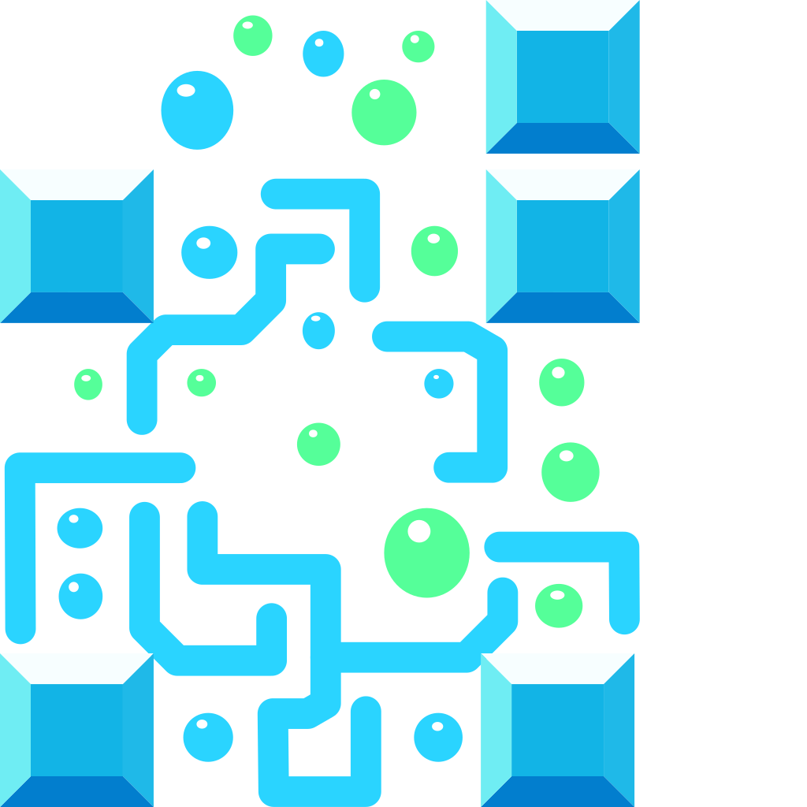

<div align="center">



# Quantris

</div>

Welcome to the Quantris repository! It has all the main mechanics of the original game (rotations, dropping, line clears), with additional functionality (each piece represents a quantum gate operator on the quantum state, which the user needs to utilize to meet the objectives).

To play Quatris using the web version: [http://quantris.pages.dev](http://quantris.pages.dev)

To see a video demonstration: [https://www.youtube.com/watch?v=_Uonyu2nNHg](https://www.youtube.com/watch?v=_Uonyu2nNHg)

# Game Documentation
This will go through all the controls and main functions to better understand the game from a user's perspective.

## Controls
+ Up/down: move the piece up/down
+ Left: make the piece fall faster
+ Right: drop piece
+ X/Z: rotate the piece clockwise/counterclockwise
+ R: restart

## Game Functions
+ Measurement: It will check if the observed pieces are measured with the same probabilities as the desired state, ignoring all phase factors. The game will clear all pieces to the left of the measurement, rewarding the player with 10 points each.
+ Clear Lines: It will clear a line if filled, rewarding 100, 300, 500, and 800 points for a single, double, triple, and quadruple clear, respectively.
+ Falling Piece: The piece will fall one block every second without the left arrow pressed and once every 1/5 second with the left arrow pressed.
+ Rotation: The piece will rotate according to the official Tetromino shape locations using the SRS kickback system.
+ Lose Condition: The game will be lost if the measurement is incorrect or a piece is placed out of bounds.
+ Piece Generation: A new piece will be generated, with a control gate or anti-control (50/50 chance) in a set location for each piece (the I piece never gets either because the control gate would have nothing to point to on a sideways I), and with otherwise completely random gates

## Game Archetecture Notes
+ All Peicies are an entity with a location rather than an array grid
+ All locations are tracked through the entity's properties, then updated using the `update_block_transforms,` `hide_outside_blocks,` and `move_control_wires` methods.
+ Entities are never regenerated; each entity will last the lifetime of each block it represents rather than being respawned at some point.
+ The only difference between a falling and stationary block is in the `Piece` attribute.

## Developer Notes
Run: `cargo run`

Build for web:
```
  cargo build --release --target wasm32-unknown-unknown
  wasm-bindgen --out-dir ./out/ --target web ./target/wasm32-unknown-unknown/release/quantris.wasm
```
